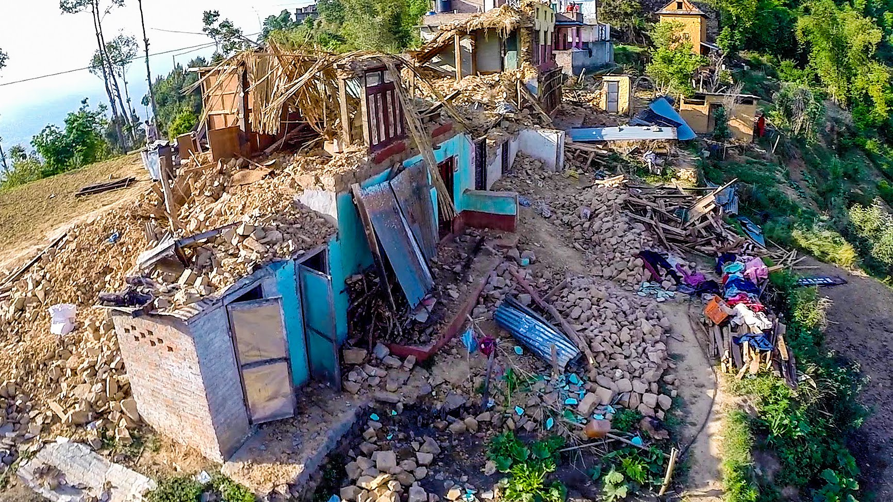

  
## Summary  

Nepal had devastating earthquake in 2015. Thousands of people suffered from this disaster. 

We use data set from [Open Data Nepal](http://data.opennepal.net/content/causalities-caused-earthquake2015) for visualization.

In this visualization project, we explore the data based on injuries and death.

## Total Deaths by Gender

## Total Deaths in Bagmati Zone

