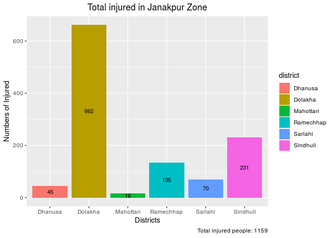
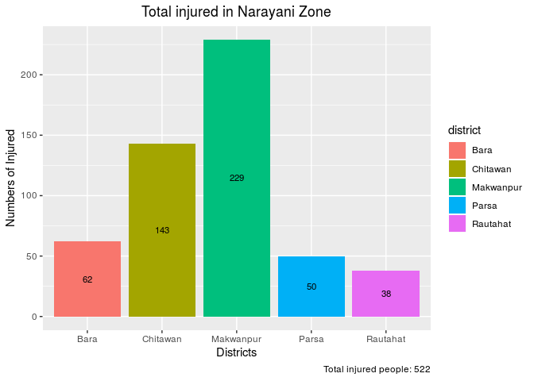

This is a visualization project in R programming. Here, we use earthquake causalities data set. 


# First, set working directory


```r
path <- setwd("/home/bjungbogati/Desktop/DataSansar/Projects/earthquake_visualization")
```

# Download data


```r
url <- "https://raw.githubusercontent.com/opennepal/odp-disaster/master/Causalities%20caused%20by%20earthquake%2C2015/data.csv"

download.file(url, destfile = "./data/earthquake_nepal.csv")
```


# Read the data


```r
library(readr)
earthquake_df <- read_csv("./data/earthquake_nepal.csv")
```

```
## Parsed with column specification:
## cols(
##   District = col_character(),
##   Zone = col_character(),
##   `Geographical Region` = col_character(),
##   `Development Region` = col_character(),
##   Causalities = col_character(),
##   `In Number` = col_integer()
## )
```

# Look into top 6 rows

```r
head(earthquake_df)
```

```
## # A tibble: 6 x 6
##   District Zone  `Geographical R… `Development Re… Causalities `In Number`
##   <chr>    <chr> <chr>            <chr>            <chr>             <int>
## 1 Sindhup… Bagm… Mountain         Central          Total No. …       66688
## 2 Sindhup… Bagm… Mountain         Central          Total Popu…      287798
## 3 Sindhup… Bagm… Mountain         Central          Dead Male          1497
## 4 Sindhup… Bagm… Mountain         Central          Dead Female        1943
## 5 Sindhup… Bagm… Mountain         Central          Dead Unkno…           0
## 6 Sindhup… Bagm… Mountain         Central          Injured            1571
```
# Names of Columns


```r
names(earthquake_df)
```

```
## [1] "District"            "Zone"                "Geographical Region"
## [4] "Development Region"  "Causalities"         "In Number"
```

# Renaming columns


```r
names(earthquake_df) <- c("district", "zone", "geo_region", "dev_region", "causalties", "numbers")
head(earthquake_df)
```

```
## # A tibble: 6 x 6
##   district      zone    geo_region dev_region causalties          numbers
##   <chr>         <chr>   <chr>      <chr>      <chr>                 <int>
## 1 Sindhupalchok Bagmati Mountain   Central    Total No. of Houses   66688
## 2 Sindhupalchok Bagmati Mountain   Central    Total Population     287798
## 3 Sindhupalchok Bagmati Mountain   Central    Dead Male              1497
## 4 Sindhupalchok Bagmati Mountain   Central    Dead Female            1943
## 5 Sindhupalchok Bagmati Mountain   Central    Dead Unknown              0
## 6 Sindhupalchok Bagmati Mountain   Central    Injured                1571
```

# Summary statistics


```r
summary(earthquake_df)
```

```
##    district             zone            geo_region       
##  Length:750         Length:750         Length:750        
##  Class :character   Class :character   Class :character  
##  Mode  :character   Mode  :character   Mode  :character  
##                                                          
##                                                          
##                                                          
##   dev_region         causalties           numbers       
##  Length:750         Length:750         Min.   :      0  
##  Class :character   Class :character   1st Qu.:      0  
##  Mode  :character   Mode  :character   Median :     14  
##                                        Mean   :  45065  
##                                        3rd Qu.:   3287  
##                                        Max.   :1744240
```

# Get the injured persons

```r
# load the dplyr package
library(dplyr)
```

```
## 
## Attaching package: 'dplyr'
```

```
## The following objects are masked from 'package:stats':
## 
##     filter, lag
```

```
## The following objects are masked from 'package:base':
## 
##     intersect, setdiff, setequal, union
```

```r
injured <- earthquake_df %>% 
  filter(causalties == "Injured")

head(injured)
```

```
## # A tibble: 6 x 6
##   district      zone    geo_region dev_region causalties numbers
##   <chr>         <chr>   <chr>      <chr>      <chr>        <int>
## 1 Sindhupalchok Bagmati Mountain   Central    Injured       1571
## 2 Kathmandu     Bagmati Hill       Central    Injured       7859
## 3 Nuwakot       Bagmati Hill       Central    Injured       1052
## 4 Dhading       Bagmati Hill       Central    Injured       1218
## 5 Rasuwa        Bagmati Mountain   Central    Injured        771
## 6 Gorkha        Gandaki Hill       Western    Injured        952
```

# No. of person injured in Bagmati


```r
zone <- earthquake_df %>%
  filter(zone == "Bagmati")
zone
```

```
## # A tibble: 80 x 6
##    district      zone    geo_region dev_region causalties          numbers
##    <chr>         <chr>   <chr>      <chr>      <chr>                 <int>
##  1 Sindhupalchok Bagmati Mountain   Central    Total No. of Houses   66688
##  2 Sindhupalchok Bagmati Mountain   Central    Total Population     287798
##  3 Sindhupalchok Bagmati Mountain   Central    Dead Male              1497
##  4 Sindhupalchok Bagmati Mountain   Central    Dead Female            1943
##  5 Sindhupalchok Bagmati Mountain   Central    Dead Unknown              0
##  6 Sindhupalchok Bagmati Mountain   Central    Injured                1571
##  7 Sindhupalchok Bagmati Mountain   Central    Govt. Houses Fully…       0
##  8 Sindhupalchok Bagmati Mountain   Central    Govt. Houses Parti…       0
##  9 Sindhupalchok Bagmati Mountain   Central    Public House Fully…   63885
## 10 Sindhupalchok Bagmati Mountain   Central    Public House Parti…    2751
## # ... with 70 more rows
```

# Visualize data


```r
library(ggplot2)

ggplot(zone, aes(x = district, y = numbers)) +
  geom_bar(stat = "identity", aes(fill = district),position = "dodge")
```

<!-- -->


# Finding total deaths


```r
# find the total number of deaths based on gender
female_num <- earthquake_df %>% 
  select(causalties, numbers) %>% 
  filter(causalties == "Dead Female") %>% 
  summarise(gender = "female", deaths = sum(numbers))

male_num <- male_death <- earthquake_df %>% 
  select(causalties, numbers) %>% 
  filter(causalties == "Dead Male") %>% 
  summarise(gender = "male", deaths = sum(numbers))

# combine the rows of dataframe : male_sum and female_sum
total_death <- bind_rows(female_num, male_num)

total_death <- total_death %>% mutate(percent = round(deaths/sum(deaths) * 100))
total_death
```

```
## # A tibble: 2 x 3
##   gender deaths percent
##   <chr>   <int>   <dbl>
## 1 female   4801     55.
## 2 male     3896     45.
```

```r
# total death
t <- sum(total_death$deaths)

# rbind(c("Total", sum(total_death$deaths)))

# visualize the plot
ggplot(total_death, aes(x = "", y = deaths, fill = gender)) +
  geom_bar(stat = "identity", width = 0.3) +
  coord_polar("y", start=0) +
  labs(title="Percentage of Death by Gender", caption= "Female : 55 % \n Male : 45 %") +
  geom_text(aes(label = deaths),position = position_stack(vjust = 0.5), size = 3) 
```

<!-- -->


# Death by Gender


```r
female_death <- earthquake_df %>% 
  filter(causalties == "Dead Female")
female_death
```

```
## # A tibble: 75 x 6
##    district      zone     geo_region dev_region causalties  numbers
##    <chr>         <chr>    <chr>      <chr>      <chr>         <int>
##  1 Sindhupalchok Bagmati  Mountain   Central    Dead Female    1943
##  2 Kathmandu     Bagmati  Hill       Central    Dead Female     600
##  3 Nuwakot       Bagmati  Hill       Central    Dead Female     625
##  4 Dhading       Bagmati  Hill       Central    Dead Female     393
##  5 Rasuwa        Bagmati  Mountain   Central    Dead Female     310
##  6 Gorkha        Gandaki  Hill       Western    Dead Female     230
##  7 Bhaktapur     Bagmati  Hill       Central    Dead Female     215
##  8 Kavre         Bagmati  Hill       Central    Dead Female     189
##  9 Lalitpur      Bagmati  Hill       Central    Dead Female     107
## 10 Dolakha       Janakpur Mountain   Central    Dead Female      85
## # ... with 65 more rows
```


```r
male_death <- earthquake_df %>% 
  filter(causalties == "Dead Male")

male_death
```

```
## # A tibble: 75 x 6
##    district      zone     geo_region dev_region causalties numbers
##    <chr>         <chr>    <chr>      <chr>      <chr>        <int>
##  1 Sindhupalchok Bagmati  Mountain   Central    Dead Male     1497
##  2 Kathmandu     Bagmati  Hill       Central    Dead Male      621
##  3 Nuwakot       Bagmati  Hill       Central    Dead Male      456
##  4 Dhading       Bagmati  Hill       Central    Dead Male      340
##  5 Rasuwa        Bagmati  Mountain   Central    Dead Male      287
##  6 Gorkha        Gandaki  Hill       Western    Dead Male      213
##  7 Bhaktapur     Bagmati  Hill       Central    Dead Male      118
##  8 Kavre         Bagmati  Hill       Central    Dead Male      129
##  9 Lalitpur      Bagmati  Hill       Central    Dead Male       67
## 10 Dolakha       Janakpur Mountain   Central    Dead Male       84
## # ... with 65 more rows
```


# Visualize


```r
ggplot(female_death, aes(x = dev_region, y = numbers)) +
  geom_bar(stat = "identity", aes(fill = zone), position = "dodge") +
  labs(title="No. of Female death by zone", y="Numbers of Injured", x="Districts") +
  theme(plot.title = element_text(hjust = 0.5))
```

<!-- -->

```r
ggplot(male_death, aes(x = dev_region, y = numbers)) +
  geom_bar(stat = "identity", aes(fill = zone), position = "dodge") +
  labs(title="No of. Male death by zone", y="Numbers of Injured", x="Districts") +
  theme(plot.title = element_text(hjust = 0.5))
```

<!-- -->


# Filter by Development Region


```r
central_region <- earthquake_df %>% 
  filter(dev_region == "Central")

central_region
```

```
## # A tibble: 190 x 6
##    district      zone    geo_region dev_region causalties          numbers
##    <chr>         <chr>   <chr>      <chr>      <chr>                 <int>
##  1 Sindhupalchok Bagmati Mountain   Central    Total No. of Houses   66688
##  2 Sindhupalchok Bagmati Mountain   Central    Total Population     287798
##  3 Sindhupalchok Bagmati Mountain   Central    Dead Male              1497
##  4 Sindhupalchok Bagmati Mountain   Central    Dead Female            1943
##  5 Sindhupalchok Bagmati Mountain   Central    Dead Unknown              0
##  6 Sindhupalchok Bagmati Mountain   Central    Injured                1571
##  7 Sindhupalchok Bagmati Mountain   Central    Govt. Houses Fully…       0
##  8 Sindhupalchok Bagmati Mountain   Central    Govt. Houses Parti…       0
##  9 Sindhupalchok Bagmati Mountain   Central    Public House Fully…   63885
## 10 Sindhupalchok Bagmati Mountain   Central    Public House Parti…    2751
## # ... with 180 more rows
```

# Filter by Injured

```r
central_injured <- central_region %>% 
    filter(causalties == "Injured")

central_injured
```

```
## # A tibble: 19 x 6
##    district      zone     geo_region dev_region causalties numbers
##    <chr>         <chr>    <chr>      <chr>      <chr>        <int>
##  1 Sindhupalchok Bagmati  Mountain   Central    Injured       1571
##  2 Kathmandu     Bagmati  Hill       Central    Injured       7859
##  3 Nuwakot       Bagmati  Hill       Central    Injured       1052
##  4 Dhading       Bagmati  Hill       Central    Injured       1218
##  5 Rasuwa        Bagmati  Mountain   Central    Injured        771
##  6 Bhaktapur     Bagmati  Hill       Central    Injured       2101
##  7 Kavre         Bagmati  Hill       Central    Injured       1179
##  8 Lalitpur      Bagmati  Hill       Central    Injured       3052
##  9 Dolakha       Janakpur Mountain   Central    Injured        662
## 10 Ramechhap     Janakpur Hill       Central    Injured        135
## 11 Makwanpur     Narayani Hill       Central    Injured        229
## 12 Sindhuli      Janakpur Hill       Central    Injured        231
## 13 Chitawan      Narayani Terai      Central    Injured        143
## 14 Parsa         Narayani Terai      Central    Injured         50
## 15 Bara          Narayani Terai      Central    Injured         62
## 16 Mahottari     Janakpur Terai      Central    Injured         16
## 17 Rautahat      Narayani Terai      Central    Injured         38
## 18 Sarlahi       Janakpur Terai      Central    Injured         70
## 19 Dhanusa       Janakpur Terai      Central    Injured         45
```


```r
unique(central_injured$zone)
```

```
## [1] "Bagmati"  "Janakpur" "Narayani"
```

# Injured - Bagmati Zone - Central Region 


```r
zone_bagmati <- central_injured %>% 
  filter(zone == "Bagmati")

zone_janakpur <- central_injured %>% 
  filter(zone == "Janakpur")

zone_narayani <- central_injured %>% 
  filter(zone == "Narayani")
```

# Visualizing the injured people of Central zone


```r
# bagmati zone
ggplot(zone_bagmati, aes(x = district, y = numbers)) +
  geom_bar(stat = "identity", aes(fill = district), position = "dodge") +
  labs(title="Total injured in Bagmati Zone", y="Numbers of Injured", x="Districts", caption= paste("Total injured people:", sum(zone_bagmati$numbers))) +
  geom_text(aes(label = numbers),position = position_stack(vjust = 0.5), size = 3) +
  theme(plot.title = element_text(hjust = 0.5))
```

<!-- -->

```r
# janakpur zone
ggplot(zone_janakpur, aes(x = district, y = numbers)) +
  geom_bar(stat = "identity", aes(fill = district), position = "dodge") +
  labs(title="Total injured in Janakpur Zone", y="Numbers of Injured", x="Districts", caption= paste("Total injured people:", sum(zone_janakpur$numbers))) +
  geom_text(aes(label = numbers),position = position_stack(vjust = 0.5), size = 3) +
  theme(plot.title = element_text(hjust = 0.5))
```

<!-- -->

```r
# narayani zone
ggplot(zone_narayani, aes(x = district, y = numbers)) +
  geom_bar(stat = "identity", aes(fill = district), position = "dodge") +
  labs(title="Total injured in Narayani Zone", y="Numbers of Injured", x="Districts", caption= paste("Total injured people:", sum(zone_narayani$numbers))) +
  geom_text(aes(label = numbers),position = position_stack(vjust = 0.5), size = 3) +
  theme(plot.title = element_text(hjust = 0.5))
```

<!-- -->

